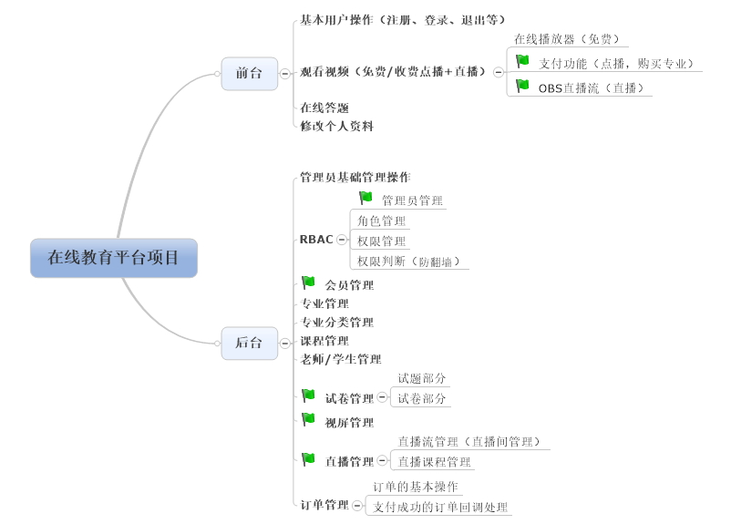

# 在线教育项目开发说明文档

# 一、项目介绍

## 1、项目开发背景

赵某某在一家上市公司担任部门主管，攒下一点积蓄，前段时间他看到在线教育市场很有发展前景，因此从现职公司离职并创办了一家公司打算踏入在线教育行业，随后开始计划招聘数位php工程师来开发一个在线教育系统，初步看看业务效果。招聘需求如下：

- [x] 具有2年以上php开发岗位工作经验；

- [x] 对面向对象思想、MVC思想有深刻的理解；

- [x] 具备Html、JavaScript、Css编写调试能力；

- [x] 熟练使用Laravel框架，具备其他框架使用经验者优先；

- [x] 熟练使用MySQL数据库，并能够为优化数据库提出方案；

- [x] 具备良好的表达能力和团队协作精神；

      

## 2、项目功能规划

初期，应确保项目在v1版本推出后，需要具备以下功能，具体功能可以参考对应模块的需求和规划：

## 3、项目涉及到的技术点

将涉及的技术点按类型进行归类，大致如下：

- **前端技术点**：为了提高前端的用户体验使用了如***datatables***（数据表格插件）、***layer***（弹窗插件）、***webuploader***（上传插件）、***zyupload***（多文件上传插件）、***ckplayer***（在线播放器）等稳定成型的插件；

- **后端技术点**：为了满足项目需求并且提高开发效率以及后期操作的便捷程度，后端使用了如***LaravelExcel***（excel文件操作类）、***七牛SDK***（操作七牛云存储以及直播流管理）、***支付接口***（用于支付，支付宝、微信均可）等技术；

- **安全技术点**：在项目中，对应的敏感字段，包括但不限于用户密码，都使用了不可逆加密方法***对数据进行了严格的加密***；其次，为了防止数据在传输过程中数据被第三方窃取篡改，项目在最终上线部署的时候使用了安全的***https协议***进行全程加密处理；

  

> tips：当然，在本项目的实际开发过程中，如果使用到了一些上面没有罗列的技术点，也是可以再添加进去的。**要自己善于总结和归纳**。

## 4、项目开发规划

- **开发环境**：windows + apache + mysql + php

  ​	版本要求：

  ​		windows：≥ win xp

  ​		apache：≥ 2.2

  ​		mysql：≥ 5.5

  ​		php：≥ 7.0

- **开发框架**：laravel（使用composer默认创建的版本）

- **开发周期**：6天（后台4天+前台2天）

- **开发工具**：sublime text 3（其他替代产品亦可）、cmder（其他替代产品亦可）

- **人员分工**：

  ​	产品经理（1人）：确定需求以及给出产品原型图

  ​	项目经理（1人）：总管项目开发，负责项目开发文档的编写，开发进度的跟踪，为团队人员提供必要的技术支持

  ​	设计人员（1人）：根据产品经理给定的产品原型图设计出项目的效果图

  ​	前端人员（1人）：根据设计人员设计好的项目效果图，切图并制作项目所需的静态页（模版文件）

  ​	后端人员（3人）：根据需求（项目经理提供的项目开发文档或者后期测试人员提供的改进建议），实现对应的模块功能

  ​	测试人员（2人）：测试项目各个模块是否存在问题（包括但不限于逻辑问题、安全问题），记录并提交给后端人员处理

# 二、管理员模块

## 1、数据字典

| **表名** | admin          |               |                            |        |            |          |
| :------: | :------------- | ------------- | -------------------------- | :----: | :--------: | :------: |
| **序号** | **字段**       | **类型**      | **说明**                   | **空** | **默认值** | **主键** |
|    1     | id             | int           | 自增主键                   |   N    |    N/A     |    是    |
|    2     | username       | varchar(20)   | 用户名                     |   N    |            |          |
|    3     | password       | varchar(255)  | 密码                       |   N    |            |          |
|    4     | gender         | enum([1,2,3]) | 性别：1=男，2=女，3=保密   |   N    |     男     |          |
|    5     | mobile         | varchar(11)   | 手机号                     |   Y    |            |          |
|    6     | email          | varchar(50)   | 电子邮箱地址               |   Y    |            |          |
|    7     | role_id        | tinyint       | 角色表中的主键             |   Y    |            |          |
|    8     | created_at     | datetime      | 记录创建时间               |   Y    |            |          |
|    9     | updated_at     | datetime      | 记录更新时间               |   Y    |            |          |
|    10    | remember_token | varchar(100)  | 记住登录功能需要存储的标记 |   Y    |            |          |
|    11    | status         | enum([1,2])   | 帐号状态：1=禁用，2=启用   |   N    |    启用    |          |

## 2、迁移文件参考代码

> up方法（建表）：

~~~php
Schema::create('admin',function($table){
    $table -> increments('id');
    $table -> string('username',20) -> notNull();
    $table -> string('password') -> notNull();
    $table -> enum('gender',[1,2,3]) -> notNull() -> default('1');
    $table -> string('mobile',11);
    $table -> string('email',50);
    $table -> tinyInteger('role_id');
    $table -> timestamps();
    $table -> rememberToken();
    $table -> enum('status',[1,2]) -> notNull() -> default('2');
});
~~~

> down方法（删表）：

~~~php
Schema::dropIfExists('admin');
~~~

## 3、种子文件参考代码

> 种子文件中需要的模拟数据较多，建议使用faker生成假数据，run方法具体代码参考如下：

~~~php
$faker = \Faker\Factory::create('zh_CN');
for($i = 0; $i < 100; $i++){ 
    DB::table('admin') -> insert([
        'username' 	=> $faker -> username(20),
        'password'	=> bcrypt('123456'),
        'gender'	=> rand(1,3),
        'mobile'	=> $faker -> phoneNumber,
        'email'		=> $faker -> email(40),
        'role_id'	=> rand(1,5),
        'created_at'=> date('Y-m-d H:i:s'),
        'status'	=> rand(1,2)
    ]);
}
~~~

# 三、RBAC部分

> RBAC常见的表现形式有“三表”和“五表”，三表便于理解，五表遵循规范，无论是三表还是五表，其核心原理是一样的。
>
> 三表：管理员表、角色表、权限表
>
> 五表：管理员表、管理员与角色的关系表、角色表、角色与权限的关系表、权限表
>
> 本部分以“三表”形式为例。

## 1、管理员部分

> 本章节需要的表在第1大章中已经创建成功，此处无需再建立数据表。

## 2、权限部分

### 2.1、数据字典

| **表名** | auth       |             |                                      |        |            |          |
| :------: | ---------- | ----------- | ------------------------------------ | :----: | :--------: | :------: |
| **序号** | **字段**   | **类型**    | **说明**                             | **空** | **默认值** | **主键** |
|    1     | id         | int         | 自增主键                             |   N    |    N/A     |    是    |
|    2     | auth_name  | varchar(20) | 权限名称，如：管理员管理             |   N    |            |          |
|    3     | controller | varchar(40) | 不带后缀的权限对应的控制器文件名     |   Y    |            |          |
|    4     | action     | varchar(30) | 权限对应的方法名称                   |   Y    |            |          |
|    5     | pid        | tinyint     | 父级权限id（2级权限），0表示顶级权限 |   N    |     0      |          |
|    6     | is_nav     | enum([1,2]) | 是否作为菜单显示，1=是，2=否         |   N    |     是     |          |

###  2.2、迁移文件参考代码

> up方法（建表）：

~~~php
Schema::create('auth',function($table){
    $table -> increments('id');
    $table -> string('auth_name',20) -> notNull();
    $table -> string('controller',40);
    $table -> string('action',30);
    $table -> tinyInteger('pid');
    $table -> enum('is_nav',[1,2]) -> notNull() -> default('1');
});
~~~

> down方法（删表）：

~~~php
Schema::dropIfExists('auth');
~~~

### 2.3、种子文件参考代码

> 该模块数据表没有创建测试数据的必要性和紧迫性，可以通过实现“添加”功能实现数据的展示。

## 3、角色部分

### 3.1、数据字典

| **表名** | role      |             |                                                              |        |            |          |      |
| :------: | --------- | ----------- | ------------------------------------------------------------ | :----: | :--------: | :------: | ---- |
| **序号** | **字段**  | **类型**    | **说明**                                                     | **空** | **默认值** | **主键** |      |
|    1     | id        | int         | 自增主键                                                     |   N    |    N/A     |    是    |      |
|    2     | role_name | varchar(20) | 角色名称，如：超级管理员                                     |   N    |            |          |      |
|    3     | auth_ids  | text        | 权限表主键id集合，如1,2,3                                    |   Y    |            |          |      |
|    4     | auth_ac   | text        | 权限对应的控制器方法集合,如：admincontroller@index,indexcontroller@index |   Y    |            |          |      |

### 3.2、迁移文件参考代码

> up方法（建表）：

~~~php
Schema::create('role',function($table){
    $table -> increments('id');
    $table -> string('role_name',20) -> notNull();
    $table -> text('auth_ids');
    $table -> text('auth_ac');
});
~~~

> down方法（删表）：

~~~php
Schema::dropIfExists('role');
~~~

### 3.3、种子文件参考代码

> 本表的数据量需求较少，可以直接操作数据表填充模拟。

# 四、会员模块

## 1、数据字典

| **表名** | member         |               |                            |        |            |          |
| :------: | -------------- | ------------- | -------------------------- | :----: | :--------: | :------: |
| **序号** | **字段**       | **类型**      | **说明**                   | **空** | **默认值** | **主键** |
|    1     | id             | int           | 自增主键                   |   N    |    N/A     |    是    |
|    2     | username       | varchar(20)   | 用户名                     |   N    |            |          |
|    3     | password       | varchar(255)  | 密码                       |   N    |            |          |
|    4     | gender         | enum([1,2,3]) | 性别：1=男，2=女，3=保密   |   N    |     男     |          |
|    5     | mobile         | varchar(11)   | 手机号                     |   Y    |            |          |
|    6     | email          | varchar(40)   | 电子邮箱地址               |   Y    |            |          |
|    7     | avatar         | varchar(255)  | 头像图片地址               |   Y    |            |          |
|    8     | created_at     | datetime      | 记录创建时间               |   Y    |            |          |
|    9     | updated_at     | datetime      | 记录更新时间               |   Y    |            |          |
|    10    | remember_token | varchar(100)  | 记住登录功能需要存储的标记 |   Y    |            |          |
|    11    | type           | enum([1,2])   | 帐号类型，1=学生，2=老师   |   N    |    学生    |          |
|    12    | status         | enum([1,2])   | 帐号状态：1=禁用，2=启用   |   N    |    启用    |          |

## 2、迁移文件参考代码

> up方法（建表）：

~~~php
Schema::create('member',function($table){
    $table -> increments('id'); 
    $table -> string('username',20) -> notNull();
    $table -> string('password') -> notNull();
    $table -> enum('gender',[1,2,3]) -> nutNull() -> default('1');
    $table -> string('mobile',11);
    $table -> string('email',40);
    $table -> string('avatar');
    $table -> timestamps();
    $table -> rememberToken();
    $table -> enum('type',[1,2]) -> notNull() -> default('1');
    $table -> enum('status',[1,2]) -> notNull() -> default('2');
});
~~~

> down方法（删表）：

~~~php
Schema::dropIfExists('member');
~~~

## 3、种子文件参考代码

> 由于生成测试数据较多，可以通过faker组件生成模拟数据：

~~~php
$faker = \Faker\Factory::create('zh_CN');
for($i = 0; $i < 100; $i++){ 
    DB::table('member') -> insert([
        'username'		=>	$faker -> userName,
        'password'		=>	bcrypt('123456'),
        'gender'		=>	rand(1,3),
        'mobile'		=>	$faker -> phoneNumber,
        'email'			=>	$faker -> email(40),
        'avatar'		=>	'/avatar.jpg',
        'created_at'	=>	date('Y-m-d H:i:s'),
        'type'			=>	rand(1,2),
        'status'		=>	rand(1,2),
    ]);
}
~~~

# 五、专业模块

## 1、专业分类部分

### 1.1、数据字典

| **表名** | protype      |             |                          |        |            |          |
| :------: | ------------ | ----------- | ------------------------ | :----: | :--------: | :------: |
| **序号** | **字段**     | **类型**    | **说明**                 | **空** | **默认值** | **主键** |
|    1     | id           | int         | 自增主键                 |   N    |    N/A     |    是    |
|    2     | protype_name | varchar(20) | 分类名                   |   N    |            |          |
|    3     | sort         | tinyInt     | 排序编号                 |   N    |     0      |          |
|    4     | created_at   | datetime    | 记录创建时间             |   Y    |            |          |
|    5     | updated_at   | datetime    | 记录更新时间             |   Y    |            |          |
|    6     | status       | enum([1,2]) | 启用状态：1=禁用，2=启用 |   N    |    启用    |          |

### 1.2、迁移文件参考代码

> up方法（建表）：

~~~php
Schema::create('protype',function($table){
    $table -> increments('id');
    $table -> string('protype_name',20) -> notNull();
    $table -> tinyInteger('sort') -> notNull() -> default('0');
    $table -> timestamps();
    $table -> enum('status',[1,2]) -> notNull() -> default('2');
});
~~~

> down方法（删表）：

~~~php
Schema::dropIfExists('protype');
~~~

### 1.3、种子文件参考代码

> 本表没有建立测试数据的紧迫性和必要性，并且由于数据的字段不多，可以通过直接操作数据表生成测试数据。

## 2、专业部分

### 2.1、数据字典

| **表名** | profession   |              |                          |        |            |          |
| :------: | ------------ | ------------ | ------------------------ | :----: | :--------: | :------: |
| **序号** | **字段**     | **类型**     | **说明**                 | **空** | **默认值** | **主键** |
|    1     | id           | int          | 自增主键                 |   N    |    N/A     |    是    |
|    2     | pro_name     | varchar(20)  | 专业名                   |   N    |            |          |
|    3     | protype_id   | tinyInt      | 专业分类表的主键         |   N    |            |          |
|    4     | teachers_ids | varchar(255) | 任课老师的id集合         |   N    |            |          |
|    5     | description  | varchar(255) | 专业描述                 |   Y    |            |          |
|    6     | cover_img    | varchar(255) | 在列表页面展示的图片地址 |   Y    |            |          |
|    7     | view_count   | int          | 点击量                   |   N    |    500     |          |
|    8     | updated_at   | datetime     | 记录更新时间             |   Y    |            |          |
|    9     | created_at   | datetime     | 记录创建时间             |   Y    |            |          |
|    10    | sort         | tinyint      | 排序编号                 |   N    |     0      |          |
|    11    | duration     | tinyint      | 课时，单位：小时         |   Y    |            |          |
|    12    | price        | decimal(7,2) | 价格，精确到两位小数     |   Y    |    0.00    |          |

### 2.2、迁移文件参考代码

> up方法（建表）：

~~~php
Schema::create('profession',function($table){
    $table -> increments('id');
    $table -> string('pro_name',20) -> notNull();
    $table -> tinyInteger('protype_id') -> notNull();
    $table -> string('teachers_ids') -> notNull();
    $table -> string('description');
    $table -> string('cover_img');
    $table -> integer('view_count') -> notNull() -> default('500');
    $table -> timestamps();
    $table -> tinyinteger('sort') -> notNull() -> default('0');
    $table -> tinyinteger('duration');
    $table -> decimal('price',7,2);
});
~~~

> down方法（删表）：

~~~php
Schema::dropIfExists('profession');
~~~

### 2.3、种子文件参考代码

~~~php
DB::table('profession') -> insert([
    'pro_name'		=>	'php基础班',
    'protype_id'	=>	'1',
    'teachers_ids'	=>	'49,51,53,56',
    'created_at'	=> 	date('Y-m-d H:i:s'),
    'duration'		=>	18,
  	'cover_img'		=>	'/cover.jpg',
    'price'			=>	'100.00'
]);
DB::table('profession') -> insert([
    'pro_name'		=>	'php就业班',
    'protype_id'	=>	'1',
    'teachers_ids'	=>	'49,51,53,56',
    'created_at'	=> 	date('Y-m-d H:i:s'),
    'duration'		=>	98,
  	'cover_img'		=>	'/cover.jpg',
    'price'			=>	'200.00'
]);
DB::table('profession') -> insert([
    'pro_name'		=>	'前端基础班',
    'protype_id'	=>	'2',
    'teachers_ids'	=>	'80,81,82,83',
    'created_at'	=> 	date('Y-m-d H:i:s'),
    'duration'		=>	90,
  	'cover_img'		=>	'/cover.jpg',
    'price'			=>	'100.00'
]);
~~~

# 六、课程模块

> 课程部分由课程和课时组成，一门课程由很多课时组成，所以两部分是存在一定的对象映射关系的。

## 1、课程部分

### 1.1、数据字典

| **表名** | course        |              |                      |        |            |          |
| :------: | ------------- | ------------ | -------------------- | :----: | :--------: | :------: |
| **序号** | **字段**      | **类型**     | **说明**             | **空** | **默认值** | **主键** |
|    1     | id            | int          | 自增主键             |   N    |    N/A     |    是    |
|    2     | course_name   | varchar(30)  | 课程名称             |   N    |            |          |
|    3     | profession_id | int          | 关联专业id           |   N    |            |          |
|    4     | description   | varchar(255) | 描述                 |   Y    |            |          |
|    5     | cover_img     | varchar(255) | 封面地址             |   Y    |            |          |
|    6     | sort          | int          | 排序编号             |   N    |     0      |          |
|    7     | created_at    | datetime     | 记录创建时间         |   Y    |            |          |
|    8     | updated_at    | datetime     | 记录更新时间         |   Y    |            |          |
|    9     | status        | enum([1,2])  | 状态：1=禁用，2=启用 |   N    |    启用    |          |

### 1.2、迁移文件参考代码

> up方法（建表）：

~~~php
Schema::create('course',function($table){
    $table -> increments('id');
    $table -> string('course_name',30) -> notNull();
    $table -> integer('profession_id') -> notNull();
    $table -> string('cover_img');
    $table -> integer('sort') -> notNull() -> default(0);
    $table -> string('description');
    $table -> timestamps();
    $table -> enum('status',[1,2]) -> notNull() -> default('2');
});
~~~

> down方法（删表）：

~~~php
Schema::dropIfExists('course');
~~~

### 1.3、种子文件参考代码

~~~php
DB::table('course') -> insert([
    'course_name'		=>		'linux',
    'profession_id'		=>		'2',
    'cover_img'			=>		'/cover.jpg',
    'created_at'		=>		date('Y-m-d H:i:s'),
]);
DB::table('course') -> insert([
    'course_name'		=>		'jQuery',
    'profession_id'		=>		'2',
    'cover_img'			=>		'/cover.jpg',
    'created_at'		=>		date('Y-m-d H:i:s'),
]);
DB::table('course') -> insert([
    'course_name'		=>		'ThinkPHP',
    'profession_id'		=>		'2',
    'cover_img'			=>		'/cover.jpg',
    'created_at'		=>		date('Y-m-d H:i:s'),
]);
DB::table('course') -> insert([
    'course_name'		=>		'laravel',
    'profession_id'		=>		'2',
    'cover_img'			=>		'/cover.jpg',
    'created_at'		=>		date('Y-m-d H:i:s'),
]);
~~~

## 2、课程点播部分

### 2.1、数据字典

| **表名** | lession      |              |                      |        |            |          |
| :------: | ------------ | ------------ | -------------------- | :----: | :--------: | :------: |
| **序号** | **字段**     | **类型**     | **说明**             | **空** | **默认值** | **主键** |
|    1     | id           | int          | 自增主键             |   N    |    N/A     |    是    |
|    2     | lession_name | varchar(50)  | 点播记录名           |   N    |            |          |
|    3     | course_id    | int          | 所属课程id           |   N    |            |          |
|    4     | video_addr   | varchar(255) | 点播视频的地址       |   N    |            |          |
|    5     | video_time   | int          | 视频的长度，单位秒   |   N    |     0      |          |
|    6     | description  | varchar(255) | 课时简单的描述       |   Y    |            |          |
|    7     | sort         | int          | 排序编号             |   N    |     0      |          |
|    8     | created_at   | datetime     | 记录创建时间         |   Y    |            |          |
|    9     | updated_at   | datetime     | 记录更新时间         |   Y    |            |          |
|    10    | status       | enum([1,2])  | 状态：1=禁用，2=启用 |   N    |    启用    |          |

### 2.2、迁移文件参考代码

> up方法（建表）：

~~~php
Schema::create('lession',function($table){
    $table -> increments('id');
    $table -> string('lession_name',50) -> notNull();
    $table -> integer('course_id') -> notNull();
    $table -> integer('video_time');
    $table -> string('video_addr');
    $table -> integer('sort') -> notNull() -> default(0);
    $table -> string('description');
    $table -> timestamps();
    $table -> enum('status',[1,2]) -> notNull() -> default('2');
});
~~~

> down方法（删表）：

~~~php
Schema::dropIfExists('lession');
~~~

### 2.3、种子文件参考代码

~~~php
DB::table('lession') -> insert([
    'lession_name'		=>		'liunx发展史',
    'course_id'			=>		'1',
    'video_addr'		=>		'/demo.mp4',
    'created_at'		=>		date('Y-m-d H:i:s'),
    'video_time'		=>		86400,
]);
DB::table('lession') -> insert([
    'lession_name'		=>		'虚拟机安装',
    'course_id'			=>		'1',
    'video_addr'		=>		'/demo.mp4',
    'created_at'		=>		date('Y-m-d H:i:s'),
    'video_time'		=>		86400,
]);
DB::table('lession') -> insert([
    'lession_name'		=>		'jQuery事件编程',
    'course_id'			=>		'2',
    'video_addr'		=>		'/demo.mp4',
    'created_at'		=>		date('Y-m-d H:i:s'),
    'video_time'		=>		86400,
]);
DB::table('lession') -> insert([
    'lession_name'		=>		'九大选择器',
    'course_id'			=>		'2',
    'video_addr'		=>		'/demo.mp4',
    'created_at'		=>		date('Y-m-d H:i:s'),
    'video_time'		=>		86400,
]);
~~~

# 七、试卷模块

> 试卷是一个笼统的概念，试卷是由试题组成，并且学生在答题的时候还需要记录答题信息。因此，该模块有试题和试卷以及答题卡三部分。

## 1、试卷部分

### 1.1、数据字典

| **表名** | paper      |             |                        |        |            |          |
| -------- | ---------- | ----------- | ---------------------- | ------ | ---------- | -------- |
| **序号** | **字段**   | **类型**    | **说明**               | **空** | **默认值** | **主键** |
| 1        | id         | int         | 自增主键               | N      | N/A        | 是       |
| 2        | paper_name | varchar(50) | 试卷名                 | N      |            |          |
| 3        | course_id  | tinyInt     | 关联课程id，所属的课程 | N      |            |          |
| 4        | score      | tinyint     | 试卷总分               | N      | 100        |          |
| 5        | updated_at | datetime    | 记录更新时间           | Y      |            |          |
| 6        | created_at | datetime    | 记录创建时间           | Y      |            |          |

###  1.2、迁移文件参考代码

> up方法（建表）：

~~~php
Schema::create('paper',function($table){
    $table -> increments('id');
    $table -> string('paper_name',50) -> notNull();
    $table -> tinyInteger('course_id') -> notNull();
    $table -> tinyInteger('score') -> notNull() -> default(100);
    $table -> timestamps();
});
~~~

> down方法（删表）：

~~~php
Schema::dropIfExists('paper');
~~~

### 1.3、种子文件参考代码

~~~php
DB::table('paper') -> insert([
    'paper_name'		=>	'ThinkPHP电子商城阶段考试',
    'course_id'			=>	3,
    'created_at'		=>	date('Y-m-d H:i:s')
]);
DB::table('paper') -> insert([
    'paper_name'		=>	'jQuery阶段考试',
    'course_id'			=>	2,
    'created_at'		=>	date('Y-m-d H:i:s')
]);
DB::table('paper') -> insert([
    'paper_name'		=>	'linux阶段考试',
    'course_id'			=>	1,
    'created_at'		=>	date('Y-m-d H:i:s')
]);
DB::table('paper') -> insert([
    'paper_name'		=>	'laravel阶段考试',
    'course_id'			=>	4,
    'created_at'		=>	date('Y-m-d H:i:s')
]);
~~~

## 2、试题部分

### 2.1、数据字典

| **表名** | question   |              |              |        |            |          |
| -------- | ---------- | ------------ | ------------ | ------ | ---------- | -------- |
| **序号** | **字段**   | **类型**     | **说明**     | **空** | **默认值** | **主键** |
| 1        | id         | int          | 自增主键     | N      | N/A        | 是       |
| 2        | question   | varchar(255) | 试题具体内容 | N      |            |          |
| 3        | paper_id   | tinyInt      | 关联试卷id   | N      |            |          |
| 4        | score      | tinyint      | 该题总分     | N      | 2          |          |
| 5        | options    | varchar(255) | 选项内容     | N      |            |          |
| 6        | answer     | varchar(1)   | 正确答案     | N      |            |          |
| 7        | remark     | varchar(255) | 试题备注说明 | Y      |            |          |
| 8        | updated_at | datetime     | 记录更新时间 | Y      |            |          |
| 9        | created_at | datetime     | 记录创建时间 | Y      |            |          |

### 2.2、迁移文件参考代码

> up方法（建表）：

~~~php
Schema::create('question',function($table){
    $table -> increments('id');
    $table -> string('question') -> notNull();
    $table -> tinyInteger('paper_id') -> notNull();
    $table -> tinyInteger('score') -> notNull() -> default(2);
    $table -> string('options') -> notNull();
    $table -> string('answer',1) -> notNull();
    $table -> string('remark');
    $table -> timestamps();
});
~~~

> down方法（删表）：

~~~php
Schema::dropIfExists('question');
~~~

### 2.3、种子文件参考代码

~~~php
DB::table('question') -> insert([
    'question'	=>	'下列关于购物车说法错误的是？',
    'paper_id'	=>	1,
    'options'	=>	'A.购物车的本质就是有一个存储数据的载体~B.购物车的数据是可以被读取的~C.购物车的数据是可以被编辑和删除的~D.购物车只能在登录之后使用',
    'answer'	=>	'D',
    'created_at'=>	date('Y-m-d H:i:s')
]);
DB::table('question') -> insert([
    'question'	=>	'支付宝接口申请不需要什么材料？',
    'paper_id'	=>	1,
    'options'	=>	'A.出身证~B.身份证~C.手机号~D.营业执照',
    'answer'	=>	'A',
    'created_at'=>	date('Y-m-d H:i:s')
]);
DB::table('question') -> insert([
    'question'	=>	'如果想用navicat将sql代码在远程服务器上执行，则必须要保证远程服务器的用户表中的host字段至少有一个为？',
    'paper_id'	=>	1,
    'options'	=>	'A.%~B.::1~C.localhost~D.127.0.0.1',
    'answer'	=>	'A',
    'created_at'=>	date('Y-m-d H:i:s')
]);
~~~

## 3、答题卡部分

### 3.1、数据字典

| **表名** | sheet       |             |                        |        |            |          |
| :------: | ----------- | ----------- | ---------------------- | :----: | :--------: | :------: |
| **序号** | **字段**    | **类型**    | **说明**               | **空** | **默认值** | **主键** |
|    1     | id          | int         | 自增主键               |   N    |    N/A     |    是    |
|    2     | paper_id    | tinyInt     | 试卷id                 |   N    |            |          |
|    3     | question_id | tinyInt     | 关联课程id，所属的课程 |   N    |            |          |
|    4     | member_id   | tinyint     | 会员id                 |   N    |            |          |
|    5     | is_correct  | enum([1,2]) | 是否正确，1=对，2=错   |   N    |     2      |          |
|    6     | score       | tinyInt     | 该题用户的得分         |   N    |     0      |          |
|    7     | answer      | varchar(1)  | 学生的答案             |   Y    |            |          |
|    8     | updated_at  | datetime    | 记录更新时间           |   Y    |            |          |
|    9     | created_at  | datetime    | 记录创建时间           |   Y    |            |          |

### 3.2、迁移文件参考代码

> up方法（建表）：

~~~php
Schema::create('sheet',function($table){
    $table -> increments('id');
    $table -> tinyInteger('paper_id') -> notNull();
    $table -> tinyInteger('question_id') -> notNull();
    $table -> tinyInteger('member_id') -> notNull();
    $table -> enum('is_correct',[1,2]) -> notNull() -> default('2');
    $table -> tinyInteger('score') -> notNull() -> default(0);
    $table -> string('answer',1);
    $table -> timestamps();
});
~~~

> down方法（删表）：

~~~php
Schema::dropIfExists('sheet');

~~~

### 3.3、种子文件参考代码

> 该部分数据由学生通过在线考试功能填写试卷之后收集得到数据，因此可以不需要进行数据模拟。

# 八、直播模块

## 1、直播间（直播流）管理部分

### 1.1、数据字典

| **表名** | stream      |               |                                        |        |            |          |
| :------: | ----------- | ------------- | -------------------------------------- | :----: | :--------: | :------: |
| **序号** | **字段**    | **类型**      | **说明**                               | **空** | **默认值** | **主键** |
|    1     | id          | int           | 自增主键                               |   N    |    N/A     |    是    |
|    2     | stream_name | varchar(200)  | 直播流名称                             |   N    |            |          |
|    3     | status      | enum([1,2,3]) | 流状态，1=正常，2=永久禁播，3=限时禁播 |   N    |    正常    |          |
|    4     | permited_at | int           | 开启直播时间戳（当状态为3时适用）      |   N    |     0      |          |
|    5     | sort        | int           | 排序编号，大→小排列                    |   N    |     0      |          |

### 1.2、迁移文件参考代码

> up方法（建表）：

~~~php
Schema::create('stream',function($table){
    $table -> increments('id');
    $table -> string('stream_name',200) -> notNull();
    $table -> enum('status',[1,2,3]) -> notNull() -> default('1');
    $table -> integer('permited_at') -> notNull() -> default(0);
    $table -> integer('sort') -> notNull() -> default(0);
});
~~~

> down方法（删表）：

~~~php
Schema::dropIfExists('stream');
~~~

### 1.3、种子文件参考代码

~~~php
DB::table('stream') -> insert([
    'stream_name'		=>		'sh09',
    'status'			=>		'2',
]);
DB::table('stream') -> insert([
    'stream_name'		=>		'test',
    'status'			=>		'3',
    'permited_at'		=>		strtotime('2017-08-18 10:52')
]);
DB::table('stream') -> insert([
    'stream_name'		=>		'sh09/sh09',
    'status'			=>		'1',
]);
~~~

## 2、直播课程部分

### 2.1、数据字典

| **表名** | live          |              |                          |        |            |          |
| :------: | ------------- | ------------ | ------------------------ | :----: | :--------: | :------: |
| **序号** | **字段**      | **类型**     | **说明**                 | **空** | **默认值** | **主键** |
|    1     | id            | int          | 自增主键                 |   N    |    N/A     |    是    |
|    2     | live_name     | varchar(50)  | 需要直播的课程名（唯一） |   N    |            |          |
|    3     | profession_id | int          | 所属的专业id，关联专业表 |   N    |            |          |
|    4     | stream_id     | int          | 对应的直播流id           |   N    |            |          |
|    5     | cover_img     | varchar(255) | 直播的封面图             |   N    |            |          |
|    6     | description   | varchar(255) | 课程简单的描述           |   Y    |            |          |
|    7     | sort          | int          | 排序编号，大→小排列      |   N    |     0      |          |
|    8     | begin_at      | int          | 直播开始时间             |   N    |            |          |
|    9     | end_at        | int          | 直播结束时间             |   N    |            |          |
|    10    | video_addr    | varchar(255) | 录播地址                 |   Y    |            |          |
|    11    | created_at    | datetime     | 记录创建时间             |   N    |            |          |
|    12    | updated_at    | datetime     | 记录更新时间             |   Y    |            |          |
|    13    | status        | enum[1,2]    | 状态，1=正常，2=禁用     |   N    |     1      |          |

### 2.2、迁移文件参考代码

> up方法（建表）：

~~~php
Schema::create('live',function($table){
    $table -> increments('id');
    $table -> string('live_name',50) -> notNull() -> unique();
    $table -> integer('profession_id') -> notNull();
    $table -> integer('stream_id') -> notNull();
    $table -> string('cover_img') -> notNull();
    $table -> integer('sort') -> notNull() -> default(0);
    $table -> string('description');
    $table -> integer('begin_at') -> notNull();
    $table -> integer('end_at') -> notNull();
    $table -> string('video_addr');
    $table -> timestamps();
    $table -> enum('status',[1,2]) -> notNull() -> default('1');
});
~~~

> down方法（删表）：

~~~php
Schema::dropIfExists('live');
~~~

### 2.3、种子文件参考代码

~~~php
DB::table('live') -> insert([
    'live_name'		=>		'北京PHP58期基础班直播课程',
    'profession_id'	=>		'1',
    'stream_id'		=>		3,
    'cover_img'		=>		'/statics/cover.jpg',
    'description'	=>		'该课程是主要为了php58期基础班课程直播，以供远程同学听课',
    'begin_at'		=>		strtotime(date('2017-7-19 00:00:00')),
    'end_at'		=>		strtotime(date('2017-8-20 18:00:00')),
]);

DB::table('live') -> insert([
    'live_name'		=>		'北京PHP58期就业班直播课程',
    'profession_id'	=>		'2',
    'stream_id'		=>		3,
    'cover_img'		=>		'/statics/cover.jpg',
    'description'	=>		'该课程是主要为了php58期就业班课程直播，以供远程同学听课',
    'begin_at'		=>		strtotime(date('2017-8-22 00:00:00')),
    'end_at'		=>		strtotime(date('2018-2-28 18:00:00')),
]);
~~~

